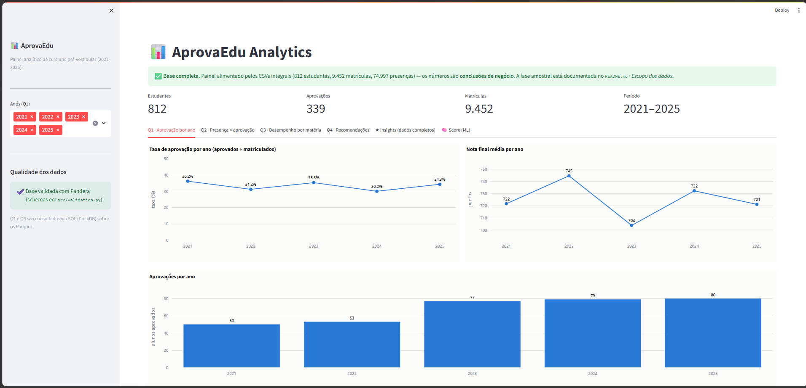
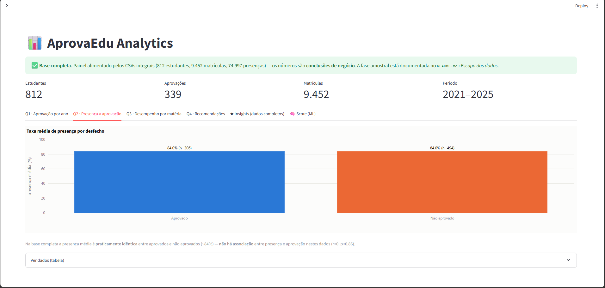
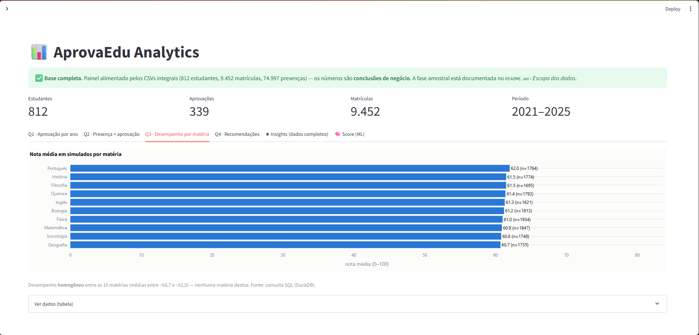
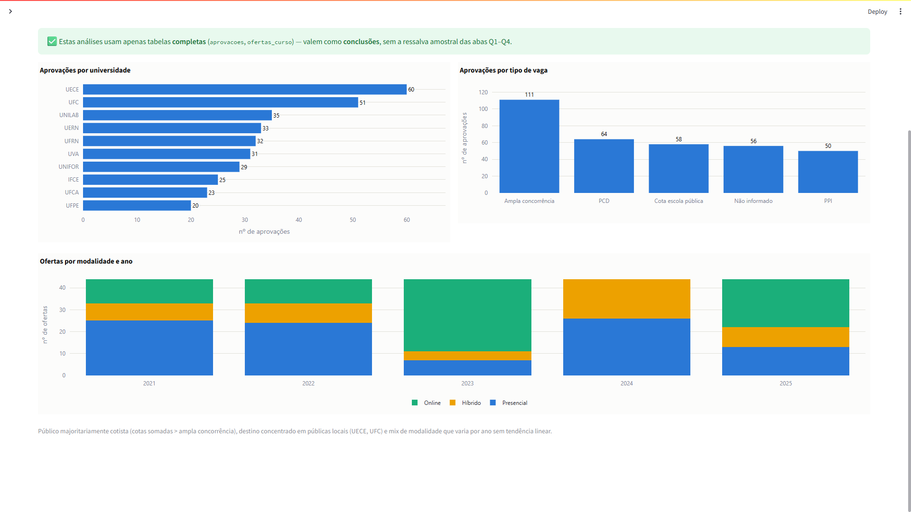
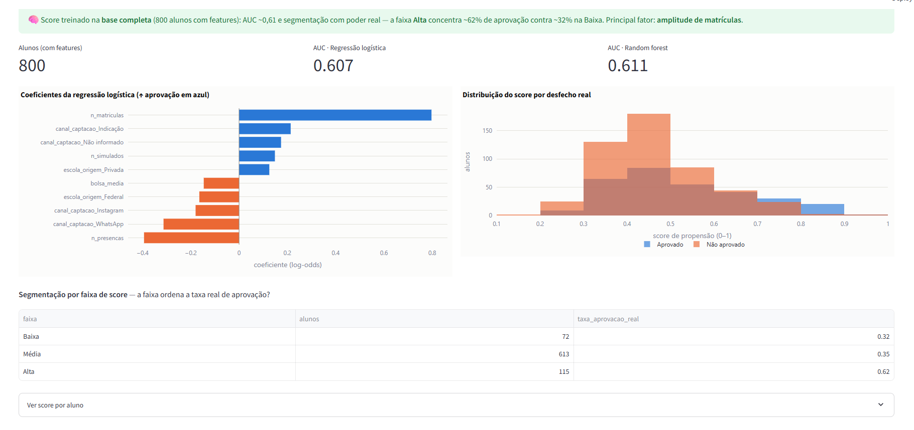

# 📊 AprovaEdu Analytics

Pipeline analítico para análise de dados educacionais de cursinho pré-vestibular (2021-2025).

## 🎯 Sobre o Projeto

Projeto de análise de dados educacionais desenvolvido como solução para o desafio técnico da AprovaEdu Analytics. A base de dados contém 5 anos de informações sobre alunos, professores, simulados, frequência e aprovações no vestibular.

## 🛠️ Stack

- **Python 3.11+**
- **Pandas / NumPy** — Manipulação de dados
- **DuckDB** — Consultas SQL in-memory
- **Pandera** — Validação de schema
- **scikit-learn** — Modelo de propensão (score)
- **Plotly / Streamlit** — Visualização
- **Docker** — Ambiente reproduzível

## 🖥️ Demonstração — dashboard

Painel interativo (Streamlit + Plotly) com as 4 análises, os insights complementares e o score de propensão — os textos e a taxa de aprovação se adaptam à fonte carregada (amostra ou base completa). Para rodar, veja *Como Executar* (ou `docker compose up --build`) e acesse http://localhost:8501.

**Visão geral e análises obrigatórias**





**Insights (dados completos) e Score preditivo (ML)**




## 📦 Escopo dos dados — duas fases

O projeto foi desenvolvido em **duas fases**, e isso estrutura os entregáveis:

**Fase 1 — amostra.** O material inicial era o XLSX `base_pre_vestibular_dicionario_amostras.xlsx` (dicionário + amostra), com as 5 tabelas maiores **truncadas nas primeiras 500 linhas** — fato **verificado** (contagem de linhas × totais da aba `Resumo`) e documentado. Com o corte por ordem de ID, os cruzamentos entre matrícula, presença e aprovação tinham sobreposição mínima (apenas **1 aluno** com os três dados), então as análises dessa fase foram entregues como **demonstração de método**, com as limitações declaradas (notebooks `01`–`04` e [`reports/relatorio_amostra.md`](reports/relatorio_amostra.md)).

**Fase 2 — base completa.** Os **CSVs integrais** foram disponibilizados depois: 812 estudantes, 9.452 matrículas, 21.510 resultados e 74.997 presenças — totais idênticos aos declarados no dicionário e **integridade referencial de 100%**. O mesmo pipeline rodou **sem mudança de método**, e as análises viraram **conclusões de negócio** (notebook `05` e [`reports/relatorio_final.md`](reports/relatorio_final.md)).

### Da amostra à base completa — o que mudou

| Dimensão | Fase 1 (amostra) | Fase 2 (base completa) |
|---|---|---|
| Alunos com matrícula + presença + aprovação | 1 | **306 (todos os aprovados)** |
| Q1 · taxa de aprovação | incalculável (denominador truncado) | **30–36% ao ano, estável** |
| Q2 · presença × aprovação | "não afirmável" (n ínfimo) | **sem associação (r≈0)** — a cautela da Fase 1 se confirmou |
| Q3 · matérias | 2 visíveis | **10, desempenho homogêneo (60,7–62,0)** |
| Score ML (AUC) | ~0,51 (acaso) | **~0,61**; faixa Alta com 62% de aprovação real |
| Validação (Pandera) | regras passando | **capturou outlier novo** (nota_diagnostico > 100) |

> O ponto central: **nenhuma linha de método mudou entre as fases** — só a fonte dos dados. A honestidade da Fase 1 (declarar o que a amostra não sustentava) foi validada pela Fase 2: a diferença de presença que parecia existir na amostra era ruído.

## 📁 Estrutura do Projeto

```
data/
  raw/          # origem: XLSX (dicionário + amostra) e PDF do desafio
  processed/    # CSVs extraídos, texto fiel ao XLSX (gerado por extract.py)
    _meta/      # abas de documentação (Resumo, Problemas_Qualidade)
  final/        # base tratada em Parquet + CSV (gerado por transform.py)
                # + _relatorio_tratamento.md com as decisões e contagens
src/
  extract.py    # Etapa 1: XLSX -> CSV (dtype=str, sem alterar nada)
  cleaning.py   # normalizadores puros + dicionários canônicos
  transform.py  # Etapa 2: tratamento e estruturação da base analítica
  validation.py # schemas Pandera (contrato da base tratada)
  queries.py    # camada analítica em SQL (DuckDB) sobre os Parquet
  features.py   # engenharia de atributos por aluno (para o modelo)
  model.py      # pipeline do score de propensão (scikit-learn)
notebooks/
  01_tratamento.ipynb        # Fase 1: extração, perfilamento e tratamento
  02_analise.ipynb           # Fase 1: as 4 análises (demonstração de método)
  03_insights.ipynb          # Fase 1: insights sobre as tabelas já completas
  04_modelo.ipynb            # Fase 1: score de propensão (pipeline de ML)
  05_analise_completa.ipynb  # Fase 2: análise definitiva na base completa
  06_persistencia.ipynb      # Fase 2: persistência/retenção como alavanca nº 1
dashboard/
  app.py        # dashboard interativo (Streamlit + Plotly); detecta a fonte dos dados
reports/
  relatorio_final.md    # relatório definitivo (base completa)
  relatorio_amostra.md  # registro da fase amostral (Fase 1)
  img/          # gráficos usados nos relatórios
docs/
  screenshots/  # prints do dashboard (usados na seção Demonstração)
```

> `data/raw`, `data/processed` e `data/final` são ignorados pelo Git; as saídas são regeneráveis pelo pipeline.

## 🚀 Como Executar

### Setup

```bash
python -m venv env
# Windows: env\Scripts\activate | Linux/Mac: source env/bin/activate
pip install -r requirements.txt
```

### Dados (obrigatório)

Os dados brutos **não são versionados** (boa prática) — são distribuídos à parte. Coloque em `data/raw/` **uma** das fontes; o `extract.py` detecta automaticamente a melhor disponível:

- **Base completa (preferida):** os 9 CSVs (`professores.csv`, `estudantes.csv`, `ofertas_curso.csv`, `matriculas.csv`, `aprovacoes_vestibular.csv`, `simulados.csv`, `resultados_simulados.csv`, `aulas.csv`, `presencas_aulas.csv`);
- **Amostra:** o XLSX `base_pre_vestibular_dicionario_amostras.xlsx` (dicionário + amostras).

As pastas `data/processed/` e `data/final/` são criadas automaticamente pelo pipeline.

### Pipeline (do bruto à base tratada)

```bash
python src/extract.py     # XLSX -> data/processed/*.csv
python src/transform.py   # -> data/final/*.parquet + *.csv + relatório
```

### Notebooks (documentação e análises)

Abra os notebooks da pasta `notebooks/` (`01_tratamento` a `04_modelo`) de uma destas formas:

- **VS Code** — abra o arquivo `.ipynb`, selecione o kernel (o ambiente `env`) e clique em **Run All**.
- **Jupyter no navegador** — rode um dos comandos abaixo; ele abre uma aba no navegador, daí é só navegar até a pasta `notebooks/`:

```bash
jupyter lab        # interface mais completa
# ou, mais simples:
jupyter notebook
```

### Docker

O container **executa o pipeline (extract → transform) e sobe o dashboard automaticamente** — basta o XLSX estar em `data/raw/` (ver *Dados*).

```bash
docker compose up --build   # dashboard em http://localhost:8501
# Docker V1 antigo: docker-compose up --build
```

## 🔍 Decisões técnicas e analíticas

Documentadas em detalhe em `notebooks/01_tratamento.ipynb` e em `data/final/_relatorio_tratamento.md`. Resumo:

- **Camada bruta fiel** — a extração lê tudo como texto (`dtype=str`, `keep_default_na=False`); nada é "limpo" antes da etapa de tratamento.
- **Datas em formatos mistos** → `datetime`; ambiguidade `dd/mm` vs `mm/dd` resolvida pela magnitude dos campos, com padrão brasileiro (`dd/mm`) no caso ambíguo.
- **Categorias inconsistentes** → dicionário canônico por *fold* (minúsculo, sem acento, sem pontuação), unificando caixa/acento/abreviação.
- **Denormalização** → `professor_id` é a fonte de verdade; o nome informado nos fatos é conferido com a dimensão e removido.
- **Duplicidade** → em Aprovações, removem-se as linhas marcadas `chamada = "Cadastro duplicado?"` (coincidem 1:1 com duplicatas por chave de negócio).
- **Outliers** → nota de simulado fora de `[0, 100]` vira nula; inconsistências de tempo/acertos são sinalizadas, não descartadas.
- **Faltantes** → medidas (notas) não são imputadas; categóricas viram `"Não informado"` quando faz sentido de negócio.
- **Validação (Pandera)** → `src/validation.py` define o "contrato" da base tratada (PKs únicas, faixas numéricas e categorias canônicas); o `transform.py` roda a validação e registra o resultado no relatório.
- **Camada SQL (DuckDB)** → `src/queries.py` responde às perguntas via SQL sobre os Parquet, como alternativa de modelagem analítica às agregações em Pandas.
- **Score preditivo (scikit-learn)** → `src/features.py` + `src/model.py` treinam um score de propensão à aprovação (Pipeline com pré-processamento, validação cruzada e interpretação). Na base completa: AUC ~0,61 e segmentação com poder real (faixa Alta: 62% de aprovação vs 32% na Baixa).

## ❓ Perguntas obrigatórias

Respondidas **com conclusões** em `notebooks/05_analise_completa.ipynb` e em [`reports/relatorio_final.md`](reports/relatorio_final.md) (base completa). Resumo:

1. **Taxa de aprovação por ano** — oscila entre ~30% e ~36%, sem tendência: a rede cresceu em matriculados, mas a conversão ficou estável.
2. **Presença × aprovação** — sem associação (84,0% vs 84,0%; r≈0): presença é uniformemente alta e não discrimina o desfecho.
3. **Desempenho por matéria** — homogêneo (médias 60,7–62,0 nas 10 matérias); sem matéria-gargalo.
4. **Recomendações** — **retenção é a alavanca nº 1**: a chance de aprovação eventual salta de 31,6% (1 ano) para 54,6% (2 anos) e 87,5% (3 anos); o aparente efeito do "nº de matrículas" era proxy da permanência (`06_persistencia.ipynb`). Complementam: score de propensão para priorizar orientação e padronização da captura de dados na origem.
