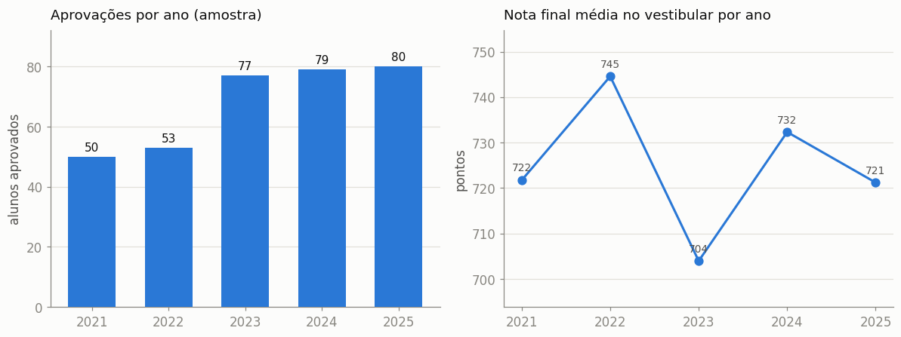
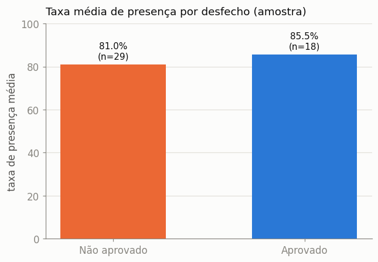
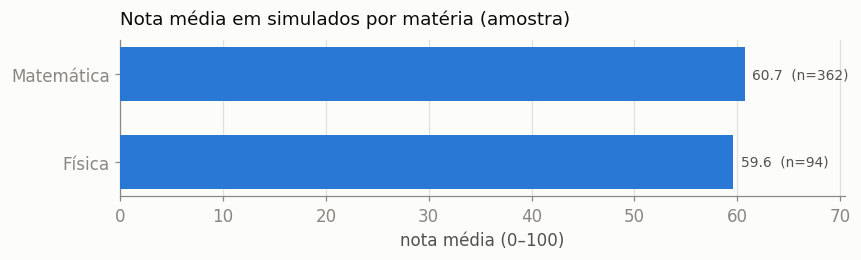
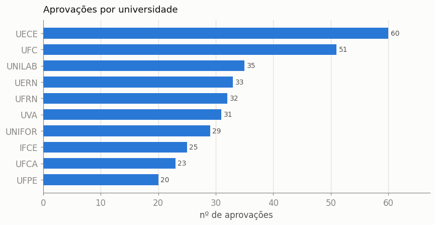
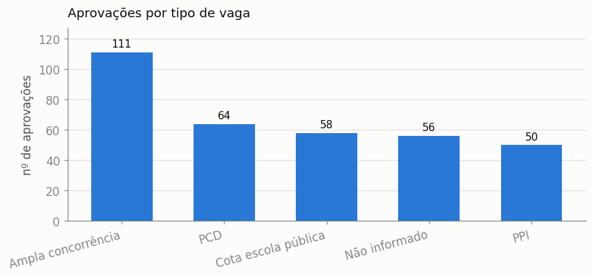

# Relatório Final — AprovaEdu Analytics

Análise de dados de uma rede de cursinhos pré-vestibular (2021–2025): tratamento da base, indicadores e recomendações para a coordenação pedagógica.

---

## 1. Contexto e objetivo

A coordenação deseja entender o desempenho dos alunos, a efetividade dos cursos e os fatores associados à aprovação no vestibular. A partir de uma base reunida de várias fontes internas — e propositalmente "suja" —, o trabalho consistiu em **ler, tratar e estruturar** os dados e **responder a quatro perguntas**:

1. Qual a evolução da taxa de aprovação ao longo dos anos?
2. Existe relação entre presença nas aulas e aprovação no vestibular?
3. Quais cursos/matérias apresentam melhor desempenho?
4. Quais recomendações apoiam a tomada de decisão da coordenação?

## 2. Metodologia

Pipeline reproduzível em camadas, do dado bruto à base analítica:

```
data/raw (origem)  →  extract.py  →  data/processed (CSV fiel)  →  transform.py  →  data/final (base tratada)
```

- **Extração fiel** — cada aba do arquivo de origem vira CSV lido como texto (`dtype=str`), preservando os valores originais; nada é "limpo" antes da etapa de tratamento.
- **Tratamento** (`cleaning.py` + `transform.py`) — padronização de datas, categorias, CPF; deduplicação por regra de negócio; conferência de denormalização; tratamento de outliers e faltantes. Cada decisão está documentada em [`notebooks/01_tratamento.ipynb`](../notebooks/01_tratamento.ipynb) e em [`data/final/_relatorio_tratamento.md`](../data/final/_relatorio_tratamento.md).
- **Análises** — [`notebooks/02_analise.ipynb`](../notebooks/02_analise.ipynb) (obrigatórias) e [`notebooks/03_insights.ipynb`](../notebooks/03_insights.ipynb) (complementares).
- **Validação** — a base tratada passa por schemas [`Pandera`](../src/validation.py): PKs únicas, faixas numéricas plausíveis e categorias dentro do conjunto canônico.
- **Modelagem analítica** — consultas SQL via [`DuckDB`](../src/queries.py) sobre os Parquet e um [dashboard interativo](../dashboard/app.py) em Streamlit.
- **Score preditivo** — pipeline scikit-learn de propensão à aprovação ([`src/features.py`](../src/features.py) + [`notebooks/04_modelo.ipynb`](../notebooks/04_modelo.ipynb)), com alvo confiável; na amostra o sinal é próximo do acaso, mas o pipeline está pronto para a base completa.

Stack: Python, Pandas, DuckDB, Pandera, Plotly/Matplotlib, Streamlit. Detalhes de execução no [`README.md`](../README.md).

## 3. Escopo dos dados (leitura obrigatória antes dos resultados)

O arquivo de origem é um **dicionário + amostra**, não a base completa. Cinco das nove tabelas vêm truncadas nas **primeiras 500 linhas** (comparação com o total declarado na aba `Resumo` do próprio dicionário):

| Tabela | Linhas disponíveis | Base completa | Situação |
|---|--:|--:|---|
| professores, ofertas_curso, simulados, aprovacoes | completas | — | ✅ íntegras |
| estudantes | 500 | 812 | ✂️ truncada |
| matriculas | 500 | 9.452 | ✂️ truncada |
| aulas | 500 | 2.418 | ✂️ truncada |
| resultados_sim | 500 | 21.510 | ✂️ truncada |
| presencas_aulas | 500 | 74.997 | ✂️ truncada |

Como o corte é **por ordem** (primeiros IDs sequenciais), as tabelas cobrem conjuntos de alunos quase disjuntos. Os cruzamentos entre matrícula, presença e aprovação têm sobreposição mínima — **apenas 1 aluno** possui os três dados.

> **Consequência:** os resultados a seguir são uma **demonstração do método de análise**, não conclusões de negócio. Com a base completa nos mesmos arquivos, todo o pipeline e os notebooks produzem os mesmos indicadores com significância estatística.

## 4. Respostas às perguntas obrigatórias

### Q1 — Evolução da taxa de aprovação por ano

A taxa de aprovação seria `aprovados(ano) ÷ base elegível(ano)`, usando como base os alunos matriculados no ano. Na amostra o denominador está truncado (6–15 matriculados/ano contra 50–80 aprovados), então reportamos dois sinais válidos no recorte: **volume de aprovações** e **nota final média** por ano.



- O volume de aprovações registradas cresce de forma monotônica (50 → 80 entre 2021 e 2025).
- A nota final média oscila em faixa estreita (~704–745), sem tendência clara.

Na base completa, a métrica-chave passa a ser a **taxa** (aprovados ÷ matriculados), aqui não confiável pelo truncamento do denominador.

### Q2 — Presença nas aulas × aprovação

Para cada aluno calculamos a **taxa de presença** (aulas com status *Presente*/*Atrasado* ÷ total de registros) e comparamos entre quem foi aprovado e quem não foi.



A direção é plausível — aprovados com presença um pouco maior (85,5%, n=18) que não aprovados (81,0%, n=29) —, mas com amostra ínfima e apenas 1 aluno com dado completo, **não se pode afirmar associação**. Na base completa, o teste adequado seria comparação de médias / correlação ponto-bisserial / regressão logística sobre presença por aluno × desfecho.

### Q3 — Matérias com melhor desempenho

Desempenho medido pela **nota média nos simulados** por matéria.



Por truncamento, os resultados cobrem poucas matérias (concentradas nos primeiros simulados), então o ranking é ilustrativo. Na base completa, o mesmo agregado cobre todas as matérias e pode ser enriquecido com dispersão (desvio-padrão), taxa de conclusão de simulados e relação com a aprovação.

### Q4 — Recomendações para a coordenação

Derivadas do método; a confirmar na base completa:

1. **Monitorar presença como sinal de risco.** A direção observada justifica acompanhar a frequência por aluno/turma e acionar quedas de presença.
2. **Priorizar reforço nas matérias de menor nota média** em simulados, realocando carga horária e revisões.
3. **Padronizar a captura de dados na origem.** O volume de inconsistências (datas em 4 formatos, categorias sem padrão, nomes denormalizados, nulos relevantes) indica ganho imediato de qualidade decisória.
4. **Instrumentar a taxa de aprovação por coorte** (ano de ingresso × ano de vestibular) para separar efeitos de turma, matéria e presença.

## 5. Insights complementares (tabelas completas — conclusões válidas)

Além das 4 perguntas (limitadas pelos cruzamentos amostrais), as tabelas que vieram **completas** — `aprovacoes` e `ofertas_curso` — permitem conclusões **sem ressalva**. Detalhe em [`notebooks/03_insights.ipynb`](../notebooks/03_insights.ipynb).





| Achado | Evidência |
|---|---|
| **Público majoritariamente cotista** | Cotas somadas (PPI + PCD + escola pública) = **172** > ampla concorrência = **111** |
| **Destino concentrado em públicas locais** | UECE (60) e UFC (51) lideram as aprovações |
| **Ingresso diversificado** | Nenhuma via domina (SISU, vestibular próprio, listas: 63–72 cada) |
| **Cortes comparáveis entre vagas** | Medianas de nota final ~715–735 — cotas **não** têm corte dramaticamente menor |
| **Preço homogêneo entre matérias** | Médias próximas (~R$ 1.285–1.355); matéria não é o eixo de precificação |
| **Modalidade instável entre anos** | Sem digitalização linear (2023 teve pico de online; 2024 zerou) |

## 6. Principais achados

- A base exige tratamento não-trivial: foram padronizadas datas, categorias e CPFs; removidas duplicatas sinalizadas em Aprovações; nulificados outliers de nota; e conferida a denormalização de professores contra a dimensão.
- O material disponível é amostral e por ordem, o que limita cruzamentos entre entidades — **documentado e verificado**, não presumido.
- O método está pronto e reproduzível: basta a base completa para transformar a demonstração em conclusões acionáveis.

## 7. Conclusão

O projeto entrega o ciclo completo — extração fiel, tratamento documentado, base analítica estruturada e as quatro análises — de forma reproduzível e honesta quanto ao escopo dos dados. As recomendações apontam caminhos concretos para a coordenação e ficam prontas para validação assim que a base completa for disponibilizada.
