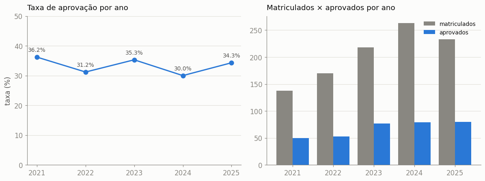
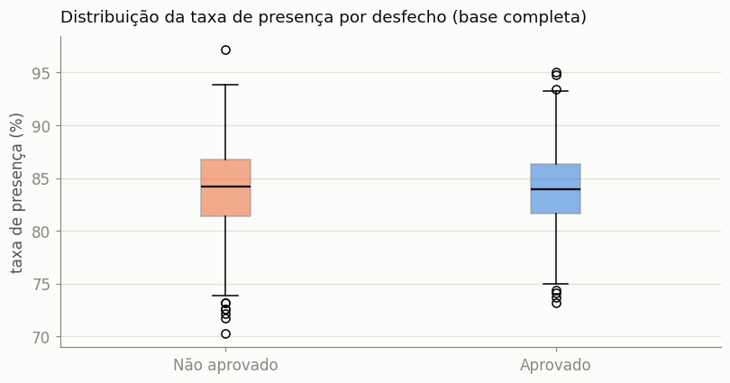
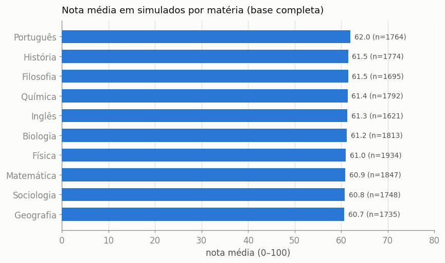
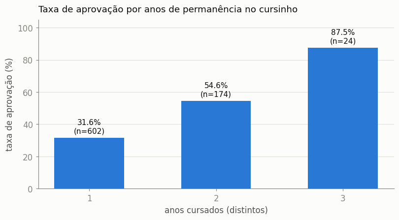
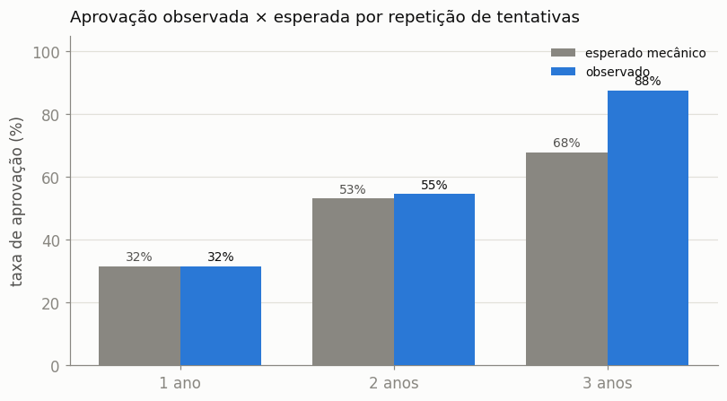

# Relatório Final — AprovaEdu Analytics

Análise de dados de uma rede de cursinhos pré-vestibular (2021–2025) sobre a **base completa**: tratamento, indicadores, respostas às perguntas obrigatórias e recomendações para a coordenação pedagógica.

---

## 1. Contexto e objetivo

A coordenação deseja entender o desempenho dos alunos, a efetividade dos cursos e os fatores associados à aprovação no vestibular. A partir de uma base reunida de várias fontes internas — e propositalmente "suja" —, o trabalho consistiu em **ler, tratar e estruturar** os dados e **responder a quatro perguntas**:

1. Qual a evolução da taxa de aprovação ao longo dos anos?
2. Existe relação entre presença nas aulas e aprovação no vestibular?
3. Quais cursos/matérias apresentam melhor desempenho?
4. Quais recomendações apoiam a tomada de decisão da coordenação?

## 2. Dados e metodologia

O trabalho teve **duas fases**. Na primeira, apenas o dicionário + amostra estava disponível (tabelas grandes truncadas em 500 linhas) — o pipeline foi construído, as decisões de tratamento documentadas e as limitações **verificadas e declaradas** ([`relatorio_amostra.md`](relatorio_amostra.md)). Na segunda, a **base completa em CSVs** foi disponibilizada: 812 estudantes, 9.452 matrículas, 21.510 resultados de simulado e 74.997 presenças — totais idênticos aos declarados na aba `Resumo` do dicionário, com **integridade referencial de 100%** em todos os relacionamentos.

O mesmo pipeline rodou **sem mudança de método**, apenas apontado para os CSVs completos:

```
data/raw (CSVs completos)  →  extract.py  →  data/processed  →  transform.py  →  data/final (Parquet)
```

- **Tratamento** — datas em formatos mistos → ISO; categorias normalizadas por dicionário canônico; deduplicação por regra de negócio (15 registros `"Cadastro duplicado?"` removidos de Aprovações); outliers de nota fora de [0,100] nulificados (2.101 em resultados de simulado — ~10% — e 9 em notas de diagnóstico); denormalização de professores conferida contra a dimensão. Detalhes: [`data/final/_relatorio_tratamento.md`](../data/final/_relatorio_tratamento.md).
- **Validação** — schemas [Pandera](../src/validation.py) (PKs únicas, faixas, categorias canônicas). O contrato **capturou automaticamente** um problema novo da base completa (notas de diagnóstico > 100) que não existia na amostra.
- **Análises** — [`notebooks/05_analise_completa.ipynb`](../notebooks/05_analise_completa.ipynb) (definitiva), [`notebooks/06_persistencia.ipynb`](../notebooks/06_persistencia.ipynb) (persistência e retenção) e camada SQL via [DuckDB](../src/queries.py).
- **Score preditivo** — pipeline scikit-learn ([`src/model.py`](../src/model.py)).

Stack: Python, Pandas, DuckDB, Pandera, scikit-learn, Plotly/Matplotlib, Streamlit, Docker.

## 3. Respostas às perguntas obrigatórias

### Q1 — Evolução da taxa de aprovação

Taxa = aprovados distintos no ano ÷ alunos distintos matriculados no ano.



| Ano | Matriculados | Aprovados | Taxa |
|---|--:|--:|--:|
| 2021 | 138 | 50 | **36,2%** |
| 2022 | 170 | 53 | **31,2%** |
| 2023 | 218 | 77 | **35,3%** |
| 2024 | 263 | 79 | **30,0%** |
| 2025 | 233 | 80 | **34,3%** |

**A taxa oscila entre ~30% e ~36%, sem tendência clara.** O crescimento do número absoluto de aprovados (50 → 80) acompanha o crescimento da base de matriculados (138 → 263): a rede **cresceu em volume, mas a conversão em aprovação ficou estável**. A nota final média dos aprovados também é estável (~704–745 pontos).

### Q2 — Presença nas aulas × aprovação



**Não há associação entre presença e aprovação nestes dados.** A presença média é praticamente idêntica nos dois grupos (**84,0% vs 84,0%**; correlação ponto-bisserial r ≈ −0,006, p ≈ 0,86) e as distribuições se sobrepõem quase por completo. A presença é uniformemente alta na rede — ela não discrimina quem aprova.

> **Nota metodológica:** na fase amostral, a diferença aparente (85,5% vs 81,0%, n=47) foi reportada como *"não permite afirmar associação"*. A base completa confirmou que era ruído amostral — a cautela evitou uma conclusão errada.

### Q3 — Desempenho por matéria



**O desempenho é homogêneo entre as 10 matérias**: médias entre **60,7 (Geografia) e 62,0 (Português)** — amplitude de ~1,3 ponto, sem matéria-gargalo nem matéria-destaque. Não há, nos dados, justificativa para realocação agressiva de carga horária entre matérias.

### Q4 — Recomendações para a coordenação

Antes das recomendações, o achado que as sustenta: **o que diferencia os aprovados?** Notas de simulado (61,1 vs 61,4), diagnóstico (58,2 vs 57,9), presença e escola de origem **não diferem** entre grupos. À primeira vista, o fator com sinal é o volume de matrículas (13,4 vs 10,8) — mas a análise de persistência ([`notebooks/06_persistencia.ipynb`](../notebooks/06_persistencia.ipynb)) mostra que ele é **um disfarce do fator real: a permanência**.



**A taxa de aprovação salta de 31,6% (1 ano) para 54,6% (2 anos) e 87,5% (3 anos).** Dois cuidados de leitura, verificados: (1) parte do ganho é mecânica — mais anos = mais tentativas de vestibular; comparando com o benchmark `1−(1−p)^k`, o 2º ano fica no esperado mecânico, mas o **3º ano excede em ~20 p.p.** (88% vs 68%), indicando ganho real acumulado (ressalva: n=24); (2) o volume de matrículas **não separa** aprovados dentro do mesmo nº de anos (9,2 vs 9,2 em quem cursou 1 ano) — era proxy da permanência.



E o **score de propensão** (regressão logística, validação cruzada) transforma o sinal em priorização: AUC ~0,61 e a faixa **Alta** concentra **62% de aprovação real** contra **32%** na Baixa.

**Recomendações:**

1. **Retenção é a alavanca nº 1.** Reter o aluno para um 2º/3º ano multiplica a chance de aprovação eventual (31,6% → 54,6% → 87,5%). Ações: pacotes plurianuais, contato ativo com quem encerra o ano sem aprovação, condições de rematrícula.
2. **Não tratar presença como preditor de aprovação** — é uniformemente alta (~84%) e não se associa ao desfecho; vale como gestão operacional, não como alerta de risco.
3. **Usar o score de propensão para priorizar orientação** — direcionar mentoria às faixas baixas (32% de aprovação) e entender o que a faixa alta (62%) faz de diferente.
4. **Manter o investimento equilibrado entre matérias** — desempenho homogêneo; melhoria deve ser transversal. (E não empilhar matérias no mesmo ano: o volume de matrículas, controlada a permanência, não faz diferença.)
5. **Padronizar a captura de dados na origem** — ~10% das notas de simulado fora da faixa válida, datas em 4 formatos, campos denormalizados; qualidade na origem barateia todo o ciclo analítico.
6. **Instrumentar a taxa de aprovação por coorte como KPI permanente** — a taxa está estável enquanto a rede cresce; a próxima alavanca é eficiência, não volume. A coorte também separa o efeito-seleção do efeito-aprendizado na persistência.

## 4. Perfil de ingresso (análises complementares)

Sobre as aprovações (306 alunos aprovados, 339 registros após deduplicação):


| Achado | Evidência |
|---|---|
| **Público majoritariamente cotista** | Cotas somadas (PPI + PCD + escola pública) = **172** > ampla concorrência = **111** |
| **Destino concentrado em públicas locais** | UECE (60) e UFC (51) lideram |
| **Ingresso diversificado** | Nenhuma via domina (SISU, vestibular próprio, listas: 63–72 cada) |
| **Cortes comparáveis entre tipos de vaga** | Medianas de nota final ~715–735 |
| **Preço homogêneo entre matérias** | Médias ~R$ 1.285–1.355 |
| **Mix de modalidade instável entre anos** | Sem tendência de digitalização (2023 pico online; 2024 zerou) |

## 5. Da amostra à base completa — o que mudou

| Dimensão | Fase amostral | Base completa |
|---|---|---|
| Alunos com matrícula + presença + aprovação | **1** | **306 (todos os aprovados)** |
| Q1 (taxa de aprovação) | incalculável (denominador truncado) | **30–36%, estável** |
| Q2 (presença × aprovação) | "direção plausível, não afirmável" | **sem associação (r≈0)** — a cautela se confirmou |
| Q3 (matérias) | 2 matérias visíveis | **10 matérias, desempenho homogêneo** |
| Score (AUC) | ~0,51 (acaso) | **~0,61**, faixa Alta com 62% de aprovação |
| Validação Pandera | todas as regras passando | **capturou outlier novo** (nota_diagnostico > 100) |

O ponto central: **nenhuma linha de método precisou mudar** — apenas a fonte dos dados. A arquitetura construída na fase amostral (extração fiel, tratamento documentado, contrato de schema, análises reproduzíveis) absorveu a base completa e converteu demonstração de método em conclusões de negócio.

## 6. Conclusão

A rede cresceu em matriculados, mas converte de forma estável (~1 aprovação a cada 3 matriculados). Presença e notas internas não explicam a aprovação; o fator com sinal real é a **permanência** — a chance de aprovação eventual salta de 31,6% para 87,5% entre o 1º e o 3º ano — e o **score de propensão** já permite priorizar a orientação pedagógica. As recomendações apontam a próxima alavanca da coordenação: **reter para converter**, com dados capturados com mais qualidade na origem para sustentar a gestão por coortes.
